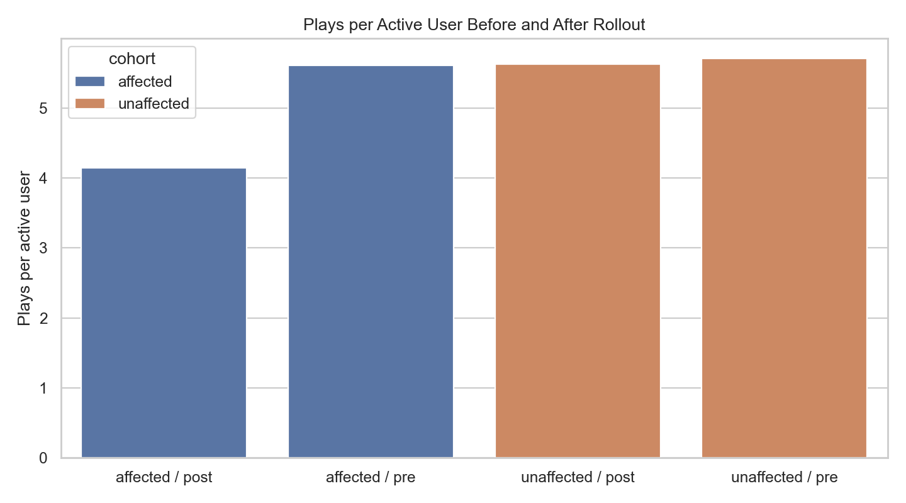
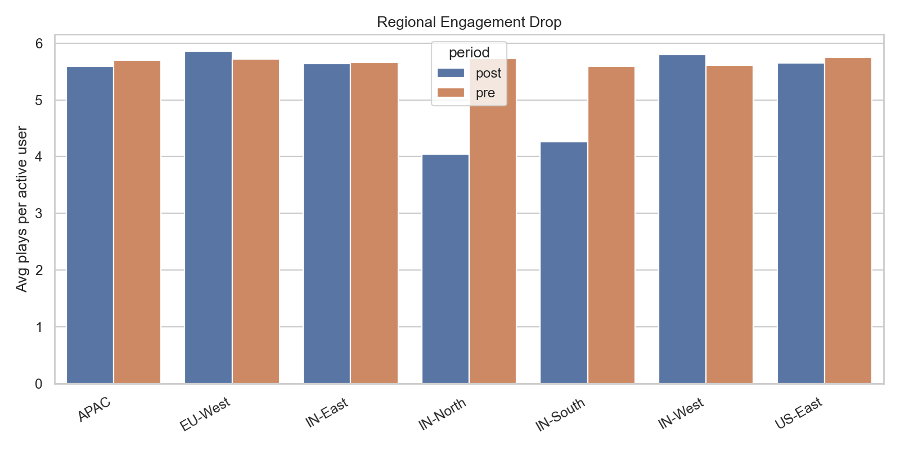
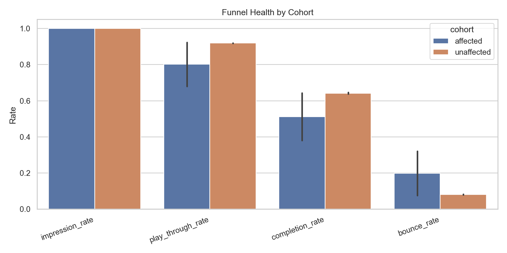
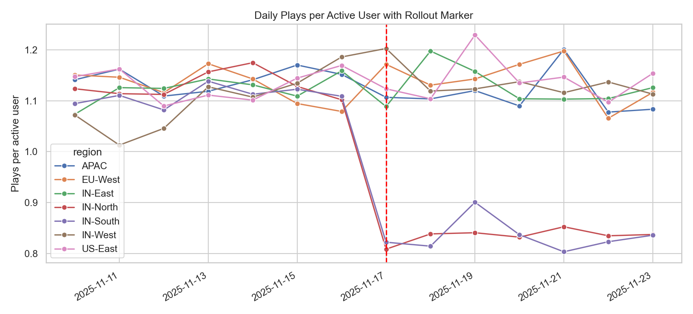

# Investigating an Engagement Collapse After a Recommendation Model Update

A SQL-first product analytics case study for diagnosing a localized engagement drop after a recommendation-model rollout.

## Executive Summary

This project simulates a streaming-product incident: a new recommendation model, `v4.2`, is rolled out to `IN-North` and `IN-South` on `2025-11-17`. Engagement drops sharply in those regions while unaffected regions remain on the stable `v4.1` model.

The analysis uses deterministic synthetic clickstream data, DuckDB SQL, Python reporting, and a Streamlit dashboard to answer a practical business question:

> Did the model rollout create a localized engagement collapse, and what should the business do next?

## Key Findings

- Affected regions: `IN-North`, `IN-South`.
- Primary metric: plays per active user.
- Affected-region engagement fell from `5.62` to `4.14` plays per active user, a `-26.3%` change.
- Unaffected regions changed by only `-1.4%` over the same period.
- Difference-in-differences estimate: `-1.396` plays per active user.
- Affected-region bounce rate increased from `7.6%` to `32.0%`.
- Affected-region completion rate fell from `64.4%` to `38.1%`.
- Estimated affected-region loss: `886` video plays and `107.3` watch hours.

The evidence supports a rollout-related degradation in the affected regions. This is not a randomized causal experiment, so the conclusion is framed as RCA evidence rather than proof.

## Recommendation

Rollback `v4.2` in `IN-North` and `IN-South`, audit ranking diversity and feature drift, then relaunch through a guarded canary with automated metric alerts.

## Visual Evidence









## Repository Structure

```text
.
|-- app.py
|-- case_study.md
|-- data_dictionary.md
|-- requirements.txt
|-- scripts/
|   |-- generate_synthetic_data.py
|   |-- validate_data.py
|   `-- run_analysis.py
|-- sql/
|   |-- data_quality_checks.sql
|   |-- metric_tree.sql
|   |-- segment_drilldown.sql
|   |-- funnel_analysis.sql
|   |-- anomaly_detection.sql
|   `-- impact_sizing.sql
|-- data/
|   |-- raw/events.jsonl
|   `-- processed/
|-- reports/
|   |-- executive_summary.md
|   |-- analysis_summary.json
|   `-- figures/
|-- notebooks/
|-- tests/
`-- .github/workflows/ci.yml
```

## Reproduce the Analysis

```bash
python -m venv .venv
.venv\Scripts\activate
pip install -r requirements.txt

python scripts/generate_synthetic_data.py
python scripts/validate_data.py
python scripts/run_analysis.py
```

On macOS or Linux, activate the environment with:

```bash
source .venv/bin/activate
```

## Dashboard

```bash
streamlit run app.py
```

The dashboard includes:

- Executive Summary
- Metric Tree
- Segment Drilldown
- Funnel
- Anomaly Detection
- Raw Data Sample

## Methodology

The project is intentionally SQL-first. Python handles orchestration, charting, and report generation, while DuckDB executes the analytical queries.

The analysis covers:

- data quality checks
- pre/post metric tree
- affected vs unaffected cohort comparison
- region/device/model-version segmentation
- session funnel analysis
- anomaly detection against a pre-rollout baseline
- business impact sizing
- bootstrap confidence interval for the affected-region pre/post delta

## Synthetic Data Disclosure

The data is synthetic and deterministic. It is designed to demonstrate product analytics methodology, not to describe a real company incident. The simulation injects a rollout-related failure only in `IN-North` and `IN-South` after `2025-11-17`; see `data_dictionary.md` for details.

## Resume Bullets

- Built a reproducible SQL-first RCA project to investigate a recommendation-model engagement collapse using DuckDB, Python, and Streamlit.
- Generated deterministic synthetic clickstream data with a documented rollout event, affected/unaffected cohorts, funnel events, and model-version metadata.
- Implemented anomaly detection, metric-tree decomposition, funnel analysis, segmentation, bootstrap intervals, and business impact sizing.
- Automated data validation, analysis report generation, dashboard inputs, and CI checks for reproducible portfolio review.
- Produced an executive case study translating analytical evidence into rollback, model-audit, and canary-monitoring recommendations.

## Limitations

- Synthetic data is useful for demonstrating method, but real production data would be required for a real business decision.
- The design is observational, not randomized.
- The simulated rollout makes the affected region mechanism clean; real incidents often include confounding from seasonality, marketing, app bugs, content mix, or logging changes.
- A production-grade system would add real-time alerting, experiment guardrails, and deeper model-feature diagnostics.
